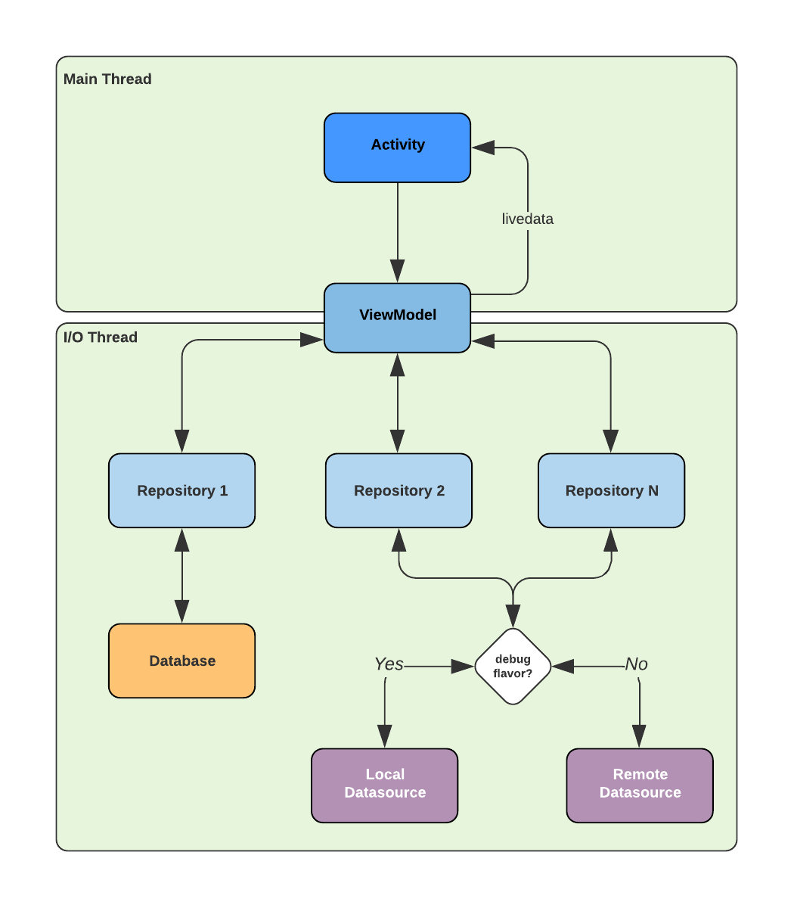

# Delivery-Much-test

App de buscas de repositórios do GitHub criado para avaliação das técnicas de desenvolvimento Android.


## Libs utilizadas

### Frontend

- Constraint Layout
- Material Design
- ViewModel + Lifecycle 
- Glide

### Dependency Injection

- Koin + Koin-ViewModel

### Network

- Retrofit
- Gson Converter

### Unit Tests

- JUnit 4.x
- MockK
- Coroutines Test

### Instrumented Tests

- JUnit 4.x
- Espresso


## Arquitetura utilizada

A arquitetura definida foi baseada no Clean Architecture, onde as camadas somente se comunicam com sua camada mais próxima, seja de modo imperativo ou reativo usando LiveData, por exemplo. Foi decidido também remover a camada mediadora entre o **ViewModel** e o **Repository**, pois como era um cenário simples, o **UseCase** seria apenas uma camada *um-para-um*.

Também foi uma decisão separar os **datasources** de acordo com o flavor, sendo assim uma vez que o código compilado seja o **release**, o repositório injetado pelo Koin será o **RemoteGithubRepository**, no caso do flavor **debug**, o repositório injetado será o **LocalGithubRepository**. Para ver essa implementação é necessário buscar pelos módulos responsáveis pela injeção de repositórios: **DataSourceModule.kt**




## Executando o app

- Para executar o app usando o flavor **debug**, usar o seguinte comando gradle:

```shell
./gradlew app:assembleDebug app:installDebug
```

- Para executar o app usando o flavor **release**, usar o seguinte comando gradle:

```shell
./gradlew app:assembleRelease app:installRelease
```


## Testes Unitários

Os testes unitários foram escritos usando **JUnit + MockK**, porém para testes de **suspend functions** e **coroutines** foi necessário criar uma classe base de testes, **BaseUnitTest.kt**, contendo o seguinte:

- Uma rule para trocar as threads dos LiveData p/ uma thread instantânea (**InstantTaskExecutorRule**);
- Uma rule para trocar os dispatchers dos coroutines para um dispatcher controlado pelos testes (ver implementação do **CoroutineTestRule**). 

Houve a necessidade de criar testes unitários para a classe **RemoteGithubRepository**, então é possível rodar os testes unitários apenas no flavor de release, onde a classe **RemoteGithubRepository** existe.

### Rodando os testes unitários

- Para executar os testes unitários é necessário rodar o seguinte comando:

```sh
./gradlew app:testReleaseUnitTest
```


## Testes Instrumentados

Os testes instrumentados foram escritos utilizando **Espresso**, porém como precisamos de uma resposta determinística e instantânea, usamos o flavor de debug para rodar os testes.

- Para executar os testes instrumentados é necessário rodar o seguinte comando:

```shell
./gradlew app:connectedDebugAndroidTest
```